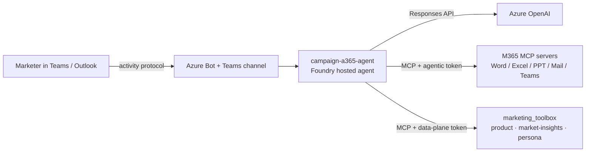

# Campaign A365 Agent — NorthStar Health

A **campaign-driving digital worker** for NorthStar Health, ported from the
Foundry autopilot `campaign_a365_agent` sample. It is a Microsoft 365 **A365
digital worker**: a hosted Azure AI Foundry agent that you *hire* into Teams and
Outlook. On every turn it calls the **Azure OpenAI Responses API** directly and
attaches two MCP tool bundles:

1. **Microsoft 365 delivery tools** (`ToolingManifest.json`) — Word, Excel,
   PowerPoint, Mail, Teams, OneDrive/SharePoint and Calendar — so it delivers
   campaign plans and performance reports *where the marketer already works*.
2. **NorthStar Health marketing tools** — the `marketing_toolbox` Foundry
   toolbox (product catalogue + market-insights + persona MCP servers), injected
   at runtime — so campaigns and reports are **grounded in real data** (sales,
   margin, growth, market share, forecast, personas, competitor products).

The worker optimises for **profitable growth**: it never chases market share at
the expense of gross margin, never proposes a promo price below the cost floor,
keeps unit cost confidential (reports margin % and deltas only), and only uses
the compliant claims the product catalogue lists for each product.

---

## Architecture



---

## Deployment steps

Run everything from the **repo root** with the project venv active
(`source .venv/bin/activate`). Configuration is read from `./.env`, which
`azd up` writes. Full context is in the [ops runbook](../../.github/skills/ops/SKILL.md).

### Prerequisites

| Tool | Notes |
|---|---|
| Azure Developer CLI (`azd`) | https://aka.ms/azd |
| Azure CLI (`az`) ≥ 2.60 | logged in as **Owner** on the subscription (`az login`) |
| Python 3.13 + | `pip install -r requirements.txt` |
| Foundry azd extension | `azd ext install microsoft.foundry` |

### Step 1 — Provision base infrastructure

Creates the AI Foundry project, Azure AI Search, Container Apps environment, ACR
(hosted-agent registry) and identities, and writes all outputs to `./.env`.

```bash
azd env set AZURE_LOCATION swedencentral
azd env set AZURE_PRINCIPAL_ID $(az ad signed-in-user show --query id -o tsv)
azd env set ENABLE_HOSTED_AGENTS true      # adds the ACR the agent image needs
azd up
```

### Step 2 — Stand up the marketing grounding data

The digital worker grounds every campaign and report in the `marketing_toolbox`.
Create the search indexes, ingest the data, deploy the three MCP servers and
register the toolbox:

```bash
python -m scripts.create_search_indexes
python -m scripts.ingest_knowledge

python -m scripts.deploy_product_mcp_server --build      # products index (8093)
python -m scripts.deploy_persona_mcp_server --build      # personas index (8094)
python -m scripts.deploy_market_insights_server --build  # sales/margin/etc (8096)

# (Entra auth on) grant agent identities + create connections
python -m scripts.create_mcp_agent_identity_connections --grant

python -m scripts.register_marketing_toolbox             # → marketing_toolbox
```

### Step 3 — Run the campaign A365 autopilot pipeline

One command runs the full digital-worker deployment. Each stage is also a
standalone `python -m scripts.autopilot.<step>` module.

```bash
python -m scripts.deploy_campaign_autopilot
```

| # | Stage (`scripts.autopilot.*`) | What it does |
|---|---|---|
| 0 | `provision_infra` | Creates the **Managed Agent Identity Blueprint** (MAIB, data-plane), grants the project identity **AcrPull** + **Cognitive Services User**, and deploys `infra/autopilot/main.bicep` (Azure Bot + Teams channel) → **blueprint client id** |
| 1 | `build_image` | Remote **`az acr build`** of the agent image (no local Docker); bakes in the blueprint id, Azure OpenAI endpoint, model deployment and marketing-toolbox endpoint |
| 2 | `create_agent` | Creates the **Foundry hosted agent** version (activity protocol), injects the marketing env vars, polls to `active`, grants the instance identity Cognitive Services User, wires the endpoint (`BotServiceRbac`) → **agent GUID** |
| 3 | `publish_digital_worker` | Publishes the agent to **Microsoft 365** as a hireable digital worker |
| 4 | `create_oauth2_grants` | Grants the blueprint service principal the **MCP / APX OAuth2 scopes** |
| 5 | `add_blueprint_owner` | Adds the current `az login` user as **owner** of the blueprint app |
| 6 | `configure_blueprint_backend` | *(optional, `--configure-backend`)* attempts to wire the bot backend via the Teams Developer Portal API. **This usually returns HTTP 403** because the API rejects Azure CLI tokens — do it in the **UI** instead (see Step 4). |

Useful flags:

```bash
# reuse an existing blueprint instead of re-provisioning
python -m scripts.deploy_campaign_autopilot --skip-infra --blueprint-id <id>

# also try the Teams Developer Portal backend (often 403 — prefer the UI)
python -m scripts.deploy_campaign_autopilot --configure-backend
```

Key overrides (env / `./.env`): `AZURE_AI_CAMPAIGN_AGENT_NAME` (default
`campaign-a365-agent`), `CAMPAIGN_A365_IMAGE_NAME`, `MAIB_NAME`,
`AZURE_OPENAI_CHAT_DEPLOYMENT_NAME`, `MARKETING_TOOLBOX_NAME`,
`MARKETING_TOOLBOX_MCP_ENDPOINT`, `MARKETING_MCP_SCOPE`.

### Step 4 — Approve & hire the digital worker

These are **manual admin steps** the pipeline cannot do — until they're done the
worker can't be hired (and "Add AI Teammate" fails):

1. **Approve** the agent blueprint in the
   [Microsoft 365 admin center → Requests](https://admin.cloud.microsoft/?#/agents/all/requested).
2. **Configure the backend in the Teams Developer Portal UI** (not the CLI): open
   `https://dev.teams.microsoft.com/tools/agent-blueprint/<blueprint-id>` →
   **Configuration** → set **Bot ID** = the blueprint id → **Save**.
   > The `configure_blueprint_backend` script / `--configure-backend` flag hits
   > the same API but returns **HTTP 403** for Azure CLI tokens (even for blueprint
   > owners), so use the UI. The upstream sample keeps this step disabled for the
   > same reason.
3. **Hire** the worker in Teams (*Apps → Agents for your team → Add*), then chat
   with it or email it — see the
   [demo flow](#demo-flow--campaign-driving--reporting) below.

> **Troubleshooting "Add AI Teammate operation did not succeed":** the blueprint
> must be approved (step 1) **and** have its backend Bot ID configured (step 2);
> ensure exactly **one** Azure Bot exists whose `msaAppId` equals the blueprint
> id (delete any stale bots), then allow 2-5 min for grants to propagate.

### Redeploy after code changes

A republish can rotate the hosted agent's Entra Agent Identity, so after a
redeploy re-grant the marketing-tool role and refresh connections:

```bash
python -m scripts.deploy_campaign_autopilot --skip-infra --blueprint-id <id>
python -m scripts.grant_agent_identity_mcp_role      # re-grant rotated identity
```

---

## Demo flow — campaign driving & reporting

Chat with the hired worker in Teams (or send it an email). It grounds every
answer in the `marketing_toolbox` data and delivers artefacts through M365.

### 1. Drive a campaign

> **Drive a Q3 Gut Health campaign for NorthStar Health in Germany aimed at the
> "health-conscious professionals" persona. Pick 3–6 hero products, set promo
> depth that keeps campaign gross margin flat-to-accretive, and forecast the
> sales and margin impact. Put the plan in an Excel workbook and write a one-page
> campaign brief in Word.**

What it does: pulls German Gut Health products + margins, competitor pressure
(e.g. NordicVital, PurePath), and the persona's motivations/channels; selects
hero SKUs (e.g. `NorthStar FloraDaily`, `NorthStar FloraGuard`); sets promo depth
above the cost floor; forecasts impact; builds the Excel plan and Word brief.

### 2. Target a persona / market

> **Which NorthStar Vitamins & Supplements should we promote to "biohackers and
> self-optimisers" in the Nordics, and with which claims and channels?**

### 3. Report on performance

> **Build a campaign performance report for Weight Management in the UK: sales,
> growth, market share vs competitors and margin trend, with the top 3 next
> actions. Put it in a Word report and a short PowerPoint deck.**

What it does: calls the market-insights tools (`get_sales`, `get_growth_rates`,
`get_market_share`, `compare_margins`, `get_forecast`) for UK Weight Management,
frames what moved and why, and delivers a Word report + PPT deck.

### 4. Portfolio triage

> **Rank NorthStar Health categories in Germany by margin contribution and
> growth, classify each as Defend / Grow / Traffic / Fix, and email me the
> summary.**

### 5. Email-driven (Outlook)

Send the worker an email: *"Give me a one-paragraph read on how our Home
Diagnostics range is performing in the Nordics vs NordicVital, and what campaign
you'd run next quarter."* It replies in-thread with a grounded recommendation.

---

## Run locally

```bash
cd src/campaign_a365_agent
cp .env.example .env          # fill in AzureOpenAIEndpoint, ModelDeployment, etc.
# point at the marketing toolbox (or a direct MCP URL for local dev):
#   MARKETING_TOOLBOX_MCP_ENDPOINT=... (or MARKETING_MCP_URL=http://127.0.0.1:8093/mcp)
# optional local M365 bearer: BEARER_TOKEN=...
python -m campaign_a365_agent          # serves /api/messages on :8088
```

---

## Marketing-tool auth

The M365 servers use the **agentic-user token** (`MCP_SCOPE`). The marketing
toolbox uses a separate bearer resolved in this order:

1. `MARKETING_TOOLBOX_BEARER_TOKEN` (explicit override — handy for local dev),
2. a token for `MARKETING_MCP_SCOPE` (default `https://ai.azure.com/.default`)
   acquired via the agent's managed identity / `DefaultAzureCredential`,
3. the shared agentic MCP bearer (works when the toolbox is exposed through the
   same A365 agentic auth).

The autopilot pipeline injects `MARKETING_TOOLBOX_MCP_ENDPOINT`,
`MARKETING_TOOLBOX_NAME`, `MARKETING_MCP_SCOPE` and `AZURE_AI_PROJECT_ENDPOINT`
into the hosted agent, so grounding works out of the box once
`marketing_toolbox` is registered.
